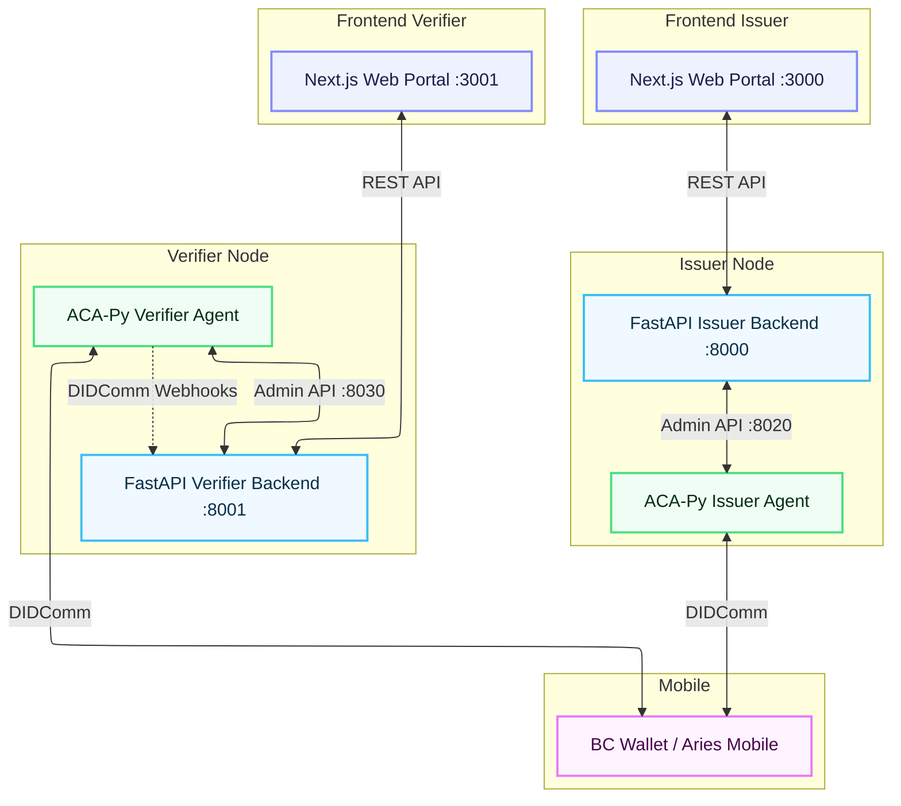

# BRAC University Zero-Trust SSI Ecosystem

A fully decoupled, Zero-Trust Self-Sovereign Identity (SSI) ecosystem designed for BRAC University. This project implements a strictly separated Issuer and Verifier microservice architecture using Aries Cloud Agent Python (ACA-Py), FastAPI, and modern Next.js frontends. 

It handles student/faculty registration, credential issuance, lab access verification, and features a real-time, encrypted 1:1 secure messaging system via DIDComm.

## 🏗 Architecture


## 📁 Repository Structure
The project is strictly divided into two independent applications, each with its own dedicated Next.js frontend and FastAPI backend:
```
.
├── docker-compose.yml       # Defines both ACA-Py agents (Issuer & Verifier)
├── issuer/
│   ├── backend/             # FastAPI (Port 8000) & setup_schema.py
│   └── frontend/            # Next.js Portal (Port 3000)
└── verifier/
    ├── backend/             # FastAPI (Port 8001) & messaging_router.py
    └── frontend/            # Next.js Portal (Port 3001)

```
## ✨ Features
- Completely Decoupled Architecture: Independent Issuer and Verifier nodes with zero shared frontend/backend state.

- Verifiable Credentials: Issues digital student/faculty IDs to digital wallets.

- Zero-Trust Access: Cryptographic proof-based authentication for campus services and lab access.

- DIDComm Secure Messaging: Real-time, peer-to-peer encrypted chat between the verifier web portal and the mobile wallet.

- Modern UI: Built with Next.js, Tailwind CSS, shadcn/ui, and Lucide icons for a premium aesthetic.


## 📋 Prerequisites
- Docker and Docker Compose

- Node.js (v18+)

- Python 3.10+

- Tunnels: Ngrok (for the Issuer) and Cloudflare Tunnels (for the Verifier).

- A compatible digital wallet (e.g., BC Wallet, Aries Bifold) installed on your mobile device.

## 🚀 Setup & Installation
### 1. Start the ACA-Py Agents
The ecosystem relies on two containerized ACA-Py agents. Ensure your tunnel URLs are correctly set in docker-compose.yml:

- issuer-acapy must use your Ngrok endpoint.
- verifier-acapy must use your Cloudflare endpoint.
```
docker compose up -d

```

### 2. Start the Backends
Open two separate terminal windows.

*Issuer Backend:*
Run the schema setup first (if running for the first time), then start the server.
```Bash
cd issuer/backend
pip install -r requirements.txt
python setup_schema.py
uvicorn main:app --port 8000 --reload
```

*Verifier Backend (Includes Messaging):*

```Bash
cd verifier/backend
pip install -r requirements.txt
uvicorn main:app --port 8001 --reload
```
### 3. Start the Frontends

Open two more terminal windows to start the independent Next.js applications.

*Issuer Frontend (Port 3000):*

```Bash
cd issuer/frontend
npm install
npm run dev
```

*Verifier Frontend (Port 3001):*

```Bash
cd verifier/frontend
npm install
npm run dev
```
#### Note: Next.js will automatically assign port 3001 if 3000 is occupied.
## 🧪 How to Run the End-to-End Demo
### Phase 1: Registration & Issuance (localhost:3000)
- Open the Issuer Web Portal (http://localhost:3000).

- Enter your student details.

- Scan the generated QR code with your mobile wallet to form a connection.

- Accept the credential offer in your wallet to receive your digital ID.

### Phase 2: Login & Lab Access (localhost:3001)
- Open the Verifier Web Portal (http://localhost:3001).

- Navigate to Login or Lab Access.

- Scan the new QR code with your wallet to connect to the Verifier.

- The portal will request a Proof of Presentation. Accept it in your wallet to cryptographically verify your identity and gain access.

### Phase 3: Secure DIDComm Messaging (localhost:3001)
- From the authenticated Verifier dashboard, open the Secure Messaging panel.

- Click "Generate Connection QR" to establish a dedicated 1:1 messaging channel.

- Scan the QR code with your wallet.

- Chat in real-time between the Next.js portal and your mobile wallet securely!
